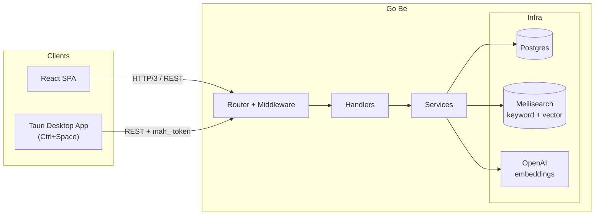

<h1 align="center">Mahzen</h1>

<p align="center">
  A self-hosted, AI-powered knowledge management platform with dual-mode search..
</p>

<div align="center">

[](https://golang.org)
[](https://www.postgresql.org)
[](https://www.meilisearch.com)
[](https://react.dev)
[](https://www.typescriptlang.org)
[](https://v2.tauri.app)
[](https://openai.com)

</div>

## Overview

> Mahzen is a self-hosted knowledge management platform. Store text entries in a hierarchical folder tree, organize them with tags, and find them again through keyword and AI-powered semantic search — from the web UI or a desktop launcher app.

## Features

- **Dual-Mode Search** - Keyword search with typo tolerance and highlighted snippets, alongside semantic vector search, rendered side by side
- **AI-Powered Embeddings** - Every entry is embedded with OpenAI `text-embedding-3-small` for meaning-based retrieval
- **Hierarchical Knowledge Tree** - Organize entries in nested folders via materialized paths, with per-folder entry counts
- **Tags & Rich Filtering** - Filter by tags, folder path, visibility, and date range across both browsing and search
- **Spotlight-Style Desktop App** - Tauri 2 launcher toggled with a global `Ctrl+Space` shortcut, connects to any self-hosted Mahzen server
- ... and more!

## Installation

### Prerequisites

```bash
  # Install Go (1.27+)
  # Install Docker (for PostgreSQL + Meilisearch)
  # Install Bun (frontend package manager)
  # Install sqlc (only if regenerating database code)
  go install github.com/sqlc-dev/sqlc/cmd/sqlc@latest
```

### Quick Start

1. **Start infrastructure** — PostgreSQL 18 and Meilisearch via Docker Compose:

   ```bash
   make docker-up
   ```

2. **Apply database migrations**:

   ```bash
   for f in migrations/*.up.sql; do
     docker exec -i mahzen-postgres psql -U mahzen -d mahzen < "$f"
   done
   ```

3. **Install frontend dependencies**:

   ```bash
   make web-install
   ```

4. **TLS certificates** — `make run` generates self-signed certificates automatically if missing. To generate them ahead of time (or to suppress the browser warning by trusting the cert):

   ```bash
   make gen-certs
   ```

5. **Run the backend** — REST API at `:8080`:

   ```bash
   make run
   ```

6. **Start the frontend dev server** in a second terminal and open `http://localhost:3000`:

   ```bash
   make web-dev
   ```

### Configuration

`config.yaml` is not committed to the repository — create it in the project root. The example below matches the Docker Compose credentials, so it works as-is for local development:

```yaml
server:
  http:
    port: 8080
    tls:
      cert_file: certs/server.crt
      key_file: certs/server.key   # clear both to run plain HTTP

database:
  host: localhost
  port: 5432
  user: mahzen
  password: mahzen
  name: mahzen
  ssl_mode: disable
  pool:
    max_conns: 10

meilisearch:
  host: localhost:7700
  api_key: mahzen-meilisearch-key

openai:
  api_key: ""                            # optional — semantic search works when set
  embedding_model: text-embedding-3-small

auth:
  jwt_secret: "change-me"

default_user:
  username: admin
  email: admin@mahzen.local
  password: mahzen
  display_name: Admin
```

Any value can also be overridden with `MAHZEN_*` environment variables (e.g. `MAHZEN_DATABASE_HOST`).

To enable AI features (semantic search), fill in `openai.api_key` with your OpenAI key. Leave it empty to run without AI — the app falls back to keyword-only search.

A default user is seeded on first startup (`default_user` section). If you change its password, subsequent restarts will never reset it — the seed only applies while the default credentials are still in place.

## Architecture



Writes are indexed asynchronously — embeddings are generated in the background and pushed to Meilisearch, so writes stay fast while search availability is eventually consistent. Two maintenance CLIs are included for ops:

- `cmd/reindex` - Rebuilds the Meilisearch index from PostgreSQL
- `cmd/regenerate-embeddings` - Recomputes OpenAI embeddings after changing the embedding model

---

<p align="center">
  <a href="mailto:emirakts0@gmail.com">emirakts0@gmail.com</a>
</p>
